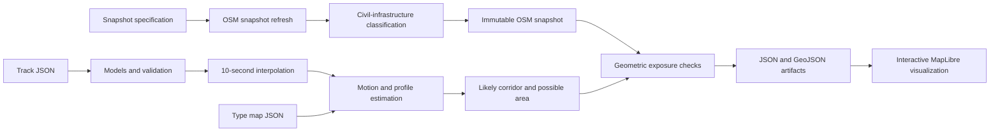

# Civil-infrastructure impact prediction

The `hazard_forecast` package predicts a target's short-term movement area and identifies civil infrastructure that intersects that area. It supports replaying a complete track and assessing only the latest state of a growing live-track history.

This package is a defensive screening tool. It does not infer intent, rank strategic value, model weapons, or include facilities that OpenStreetMap (OSM) identifies as military.

## System architecture



The system has two execution paths:

1. `osm-refresh` performs the only network operation. It downloads an allowlisted set of OSM features, classifies civil infrastructure, excludes military-tagged content, and writes an immutable snapshot with content hashes.
1. `replay` and `assess` run offline. They validate observations, interpolate the track, estimate motion, build forecast geometry, intersect that geometry with the snapshot, and write results.

### Module responsibilities

| Module | Responsibility |
| --- | --- |
| [`cli.py`](cli.py) | Defines `validate`, `osm-refresh`, `replay`, `assess`, and `render` commands. |
| [`models.py`](models.py) | Defines strict input, configuration, snapshot, and infrastructure contracts. |
| [`profiles.py`](profiles.py) | Maps caller-owned type tokens to generic mobility limits. |
| [`snapshot.py`](snapshot.py) | Queries OSM, filters military content, classifies civil infrastructure, hashes snapshots, and verifies snapshot files. |
| [`engine.py`](engine.py) | Fits motion, creates forecast geometry, applies safety buffers, and computes exposed infrastructure. |
| [`artifacts.py`](artifacts.py) | Writes JSON, JSONL, GeoJSON, manifests, and the interactive MapLibre map. |

## Processing flow

The entry point validates the input with `parse_track()` in [`models.py`](models.py#L138). For replay, `interpolate_track()` in [`models.py`](models.py#L150) resamples the history at the requested observation cadence.

For each observation, `advance()` in [`engine.py`](engine.py#L223) performs these operations:

1. Resolve the current generic mobility profile.
1. Fit heading, speed, climb rate, and residual error from recent observations.
1. Create a straight likely corridor and a compact radial possible area.
1. Verify that the required forecast geometry remains inside the snapshot coverage.
1. Buffer civil infrastructure by the fixed 500 m safety margin plus altitude-dependent uncertainty.
1. Record infrastructure whose protected geometry intersects the enabled forecast bands.

`run_replay()` in [`engine.py`](engine.py#L291) returns every historical assessment. `assess_latest()` in [`engine.py`](engine.py#L312) processes the complete supplied history but returns only the current assessment, which is suitable for a growing live input list.

## Infrastructure classification checks

Infrastructure-type checks are centralized in `_category()` in [`snapshot.py`](snapshot.py#L102). The function reads OSM tags and returns one of these civil categories:

* Power plants and substations.
* Water works, water storage, wastewater plants, and pumping stations.
* Fuel storage and fuel-related industrial sites.
* Telecommunications facilities.
* Hospitals, fire stations, and ambulance stations.
* Civil aerodromes and ports.
* Public-transport hubs.

`normalize_osm()` in [`snapshot.py`](snapshot.py#L144) calls `_category()` for every downloaded OSM element. It discards empty geometry and unrecognized categories, removes duplicates, and converts the remaining entries into `InfrastructureFeature` records.

The classifier relies only on the tags present in the immutable OSM snapshot. It does not infer a facility type from its name or location.

## Military-site filtering

Military content is excluded at two layers in [`snapshot.py`](snapshot.py):

1. `build_overpass_query()` at [`snapshot.py`](snapshot.py#L52) uses an allowlist of civil OSM tag queries. It does not request `landuse=military`, `military=*`, or `military_service=*` features.
1. `_category()` at [`snapshot.py`](snapshot.py#L102) is the normalization guard. It immediately returns `None` when an element has `landuse=military`, a `military` tag, or a `military_service` tag. This guard runs before civil-category checks, so an element tagged both `amenity=hospital` and `landuse=military` is still excluded.

The regression test [`test_osm_catalog_excludes_military_sites_and_contents()`](../tests/test_hazard_contract.py#L56) verifies both layers. This filtering is tag-based: if upstream OSM data omits military tags, the package does not attempt to infer them.

## Forecast and exposure configuration

`ForecastConfig` in [`models.py`](models.py#L58) contains the main controls:

* `step_s` sets the forecast interval.
* `likely_corridor_width_multiplier` is at least `4`, making the likely corridor four times the base uncertainty calculation.
* `danger_area_buffer_m` applies the fixed 500 m civil-safety buffer.
* `altitude_uncertainty_m_per_m` adds altitude-dependent warning distance.
* `include_possible_band` controls whether the possible band participates in coverage and exposure checks. The `--likely-only` CLI option disables that band for checks while retaining it as a map visualization.

The buffer calculation is implemented in `_exposures()` in [`engine.py`](engine.py#L160). The effective infrastructure protection distance is the greater of the feature-type buffer and:

```text
500 m + max(0, altitude_m) × altitude_uncertainty_m_per_m
```

## Run the example

From the repository root, install the package and its dependencies:

```powershell
.\.venv\Scripts\python.exe -m pip install -e .
```

Create the OSM snapshot:

```powershell
.\.venv\Scripts\python.exe -m hazard_forecast osm-refresh snapshot-spec.json `
  --output osm-snapshot
```

Replay the example at ten-second intervals:

```powershell
.\.venv\Scripts\python.exe -m hazard_forecast replay trajectory_target_input.json `
  --snapshot osm-snapshot `
  --output forecast-output `
  --type-map trajectory_target_type_map.json `
  --observation-step-s 10 `
  --horizon-s 120 `
  --step-s 10 `
  --likely-only `
  --track-id live-target-001
```

Open `forecast-output/map.html` to inspect the result. Red identifies affected infrastructure, yellow shows the likely corridor, and orange shows the possible area.

See [`CONTRACT.md`](CONTRACT.md) for the complete input and output contract.
